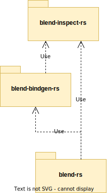

# blend-inspect-rs

A Rust library to parse and analyse Blender's .blend files.

## Description
This library belongs to a set of three libraries which are all related to the topic of reading Blender's .blend files:

* [blend-inspect-rs](https://crates.io/crates/blend-inspect-rs):
  A Rust library to parse and analyse Blender's .blend files.

* [blend-bindgen-rs](https://crates.io/crates/blend-bindgen-rs):
  A Rust library to generated Blender's data structures.

* [blend-rs](https://crates.io/crates/blend-rs):
  A Rust library to read Blender's .blend files.

## Contributions
All contributions are welcome: ideas, patches, documentation, bug reports, complaints. Any contribution intentionally submitted for inclusion in this crate by you, as defined in the Apache-2.0 license, shall be licensed without any additional terms or conditions.

## License
Licensed under Apache License, Version 2.0.
